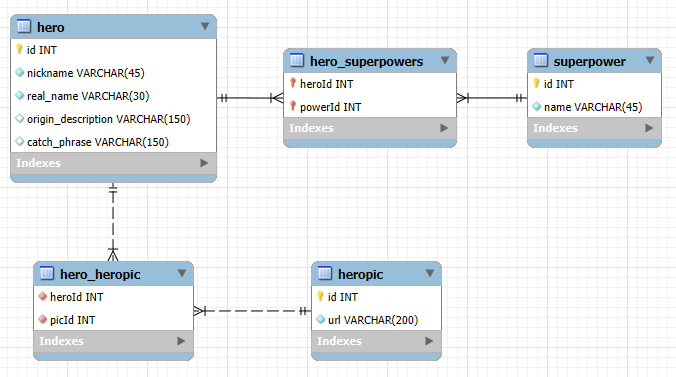

Superheroes app js test

Web application for operating with a superhero database.
Allows user do CRUD operations to manipulate with superheroes information list.

Parts of the project:

**backend** => (Node.js + Express + MySQL) ./backend

**frontend** => (React) ./client

How to start (Steps to run the solution):

1. Create or import DB with this structure (MySql DB dump with initial superhero data is located in ./"mysql db"/HeroesDB_Dump.sql):

    

2. Create .env (environment variables file) in root directory with given parameters for each part: 
 
    ../backend/.env

        PORT=server_listening_port
        DB_HOST=localhost
        DB_USER=your_user
        DB_PASSWORD=your_password
        DB_NAME=superheroes

    AND 

    ../client/.env

        REACT_APP_SERVER_URL=http://localhost:server_listening_port

3. Run both projects via terminal:

    cd backend
    npm install
    npm start

    AND

    cd client
    npm install
    npm start

Assumptions:

- backend and frontend parts will be two processes on different machines.
- database for backend part is stored locally

